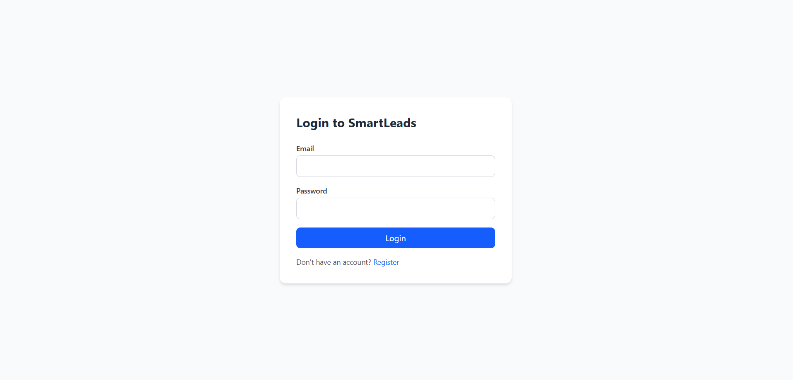
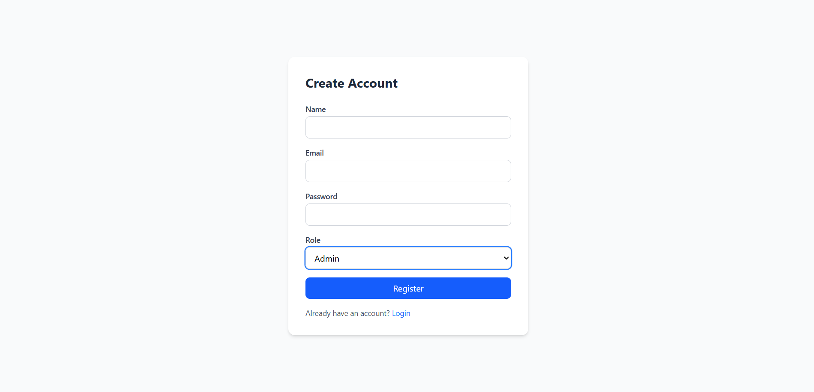
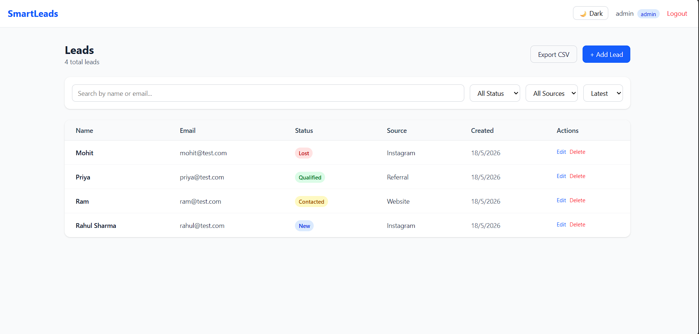
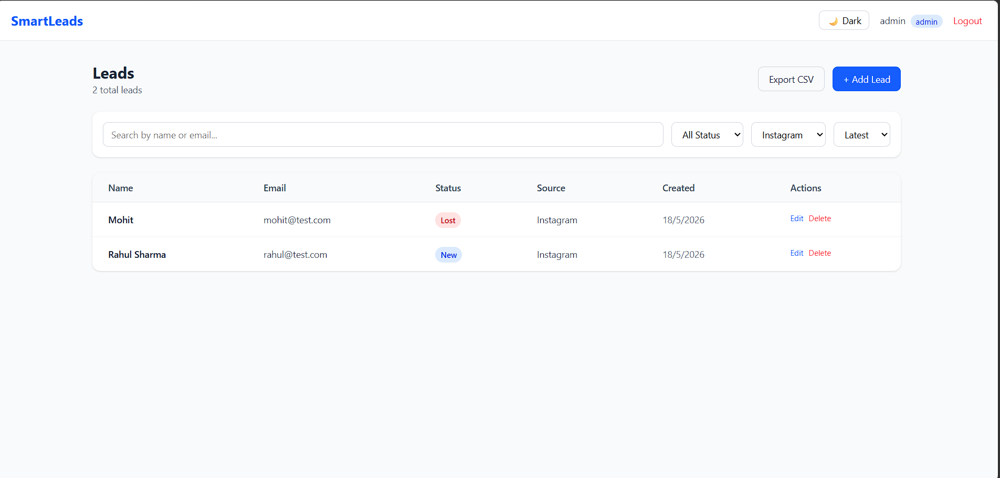

# 🚀 Smart Leads Dashboard

A full-stack Lead Management Dashboard built with the MERN stack and TypeScript. Designed to help sales teams track and manage leads through a pipeline.

---

## Live Demo

🌐 https://smart-leads-frontend.vercel.app

> ⚠️ Note: Backend is hosted on Render's free tier and may take 30-50 seconds to wake up on first request.

---
## Screenshots

### Login


### Register


### Dashboard


### Filters


---

## Features

- 🔐 JWT Authentication with bcrypt password hashing
- 👥 Role-Based Access Control (Admin / Sales)
- 📋 Leads CRUD — Create, Update, Delete, View
- 🔍 Advanced Filtering — Status, Source, Search, Sort
- 📄 Backend Pagination (10 records/page)
- ⌨️ Debounced Search
- 📥 CSV Export
- 🌙 Dark Mode
- 🐳 Docker Support
- 📱 Responsive UI

---

## Tech Stack

| Layer | Tech |
|---|---|
| Frontend | React, TypeScript, TailwindCSS |
| Backend | Node.js, Express, TypeScript |
| Database | MongoDB, Mongoose |
| Auth | JWT, bcrypt |
| DevOps | Docker, Docker Compose |

---

## Project Structure

```
smart-leads-dashboard/
├── client/                  # React + TypeScript + Tailwind
│   ├── src/
│   │   ├── components/      # Reusable UI components
│   │   ├── pages/           # Route-level pages
│   │   ├── hooks/           # Custom hooks (useDebounce)
│   │   ├── context/         # Auth context
│   │   ├── services/        # Axios API service
│   │   ├── types/           # TypeScript interfaces
│   │   └── utils/           # CSV export helper
│
├── server/                  # Node + Express + TypeScript
│   ├── src/
│   │   ├── controllers/     # Route handlers
│   │   ├── middleware/      # Auth + RBAC middleware
│   │   ├── models/          # Mongoose schemas
│   │   ├── routes/          # Express routers
│   │   └── types/           # TypeScript interfaces
│
├── docker-compose.yml
└── README.md
```

---

## Getting Started

### Prerequisites
- Node.js v20+
- MongoDB Atlas account
- Docker (optional)

### Manual Setup

**1. Clone the repo**
```bash
git clone https://github.com/YOUR_USERNAME/smart-leads-dashboard.git
cd smart-leads-dashboard
```

**2. Backend setup**
```bash
cd server
npm install
cp .env.example .env
# Fill in your .env values
npm run dev
```

**3. Frontend setup**
```bash
cd client
npm install
cp .env.example .env
npm run dev
```

### Docker Setup
```bash
# Fill in root .env file first
cp .env.example .env

docker compose up --build
```

---

## Environment Variables

### Server (`server/.env`)
```
PORT=5000
MONGO_URI=mongodb+srv://<username>:<password>@cluster.mongodb.net/smart-leads
JWT_SECRET=your_jwt_secret_key
```

### Client (`client/.env`)
```
VITE_API_URL=http://localhost:5000/api
```

---

## API Documentation

### Auth Routes
| Method | Endpoint | Description | Access |
|---|---|---|---|
| POST | /api/auth/register | Register new user | Public |
| POST | /api/auth/login | Login user | Public |

### Lead Routes
| Method | Endpoint | Description | Access |
|---|---|---|---|
| GET | /api/leads | Get all leads | Protected |
| GET | /api/leads/:id | Get single lead | Protected |
| POST | /api/leads | Create lead | Protected |
| PUT | /api/leads/:id | Update lead | Protected |
| DELETE | /api/leads/:id | Delete lead | Admin only |

### Query Parameters — GET /api/leads
| Param | Type | Description |
|---|---|---|
| search | string | Search by name or email |
| status | string | New, Contacted, Qualified, Lost |
| source | string | Website, Instagram, Referral |
| sort | string | latest or oldest |
| page | number | Page number (default: 1) |
| limit | number | Records per page (default: 10) |

### Sample Response
```json
{
  "success": true,
  "data": [...],
  "pagination": {
    "total": 50,
    "page": 1,
    "pages": 5
  }
}
```

---

## Roles

| Role | Permissions |
|---|---|
| Admin | Create, View, Update, Delete leads |
| Sales | Create, View, Update leads |

---

## Deployment

- Frontend — Vercel
- Backend — Render
- Database — MongoDB Atlas